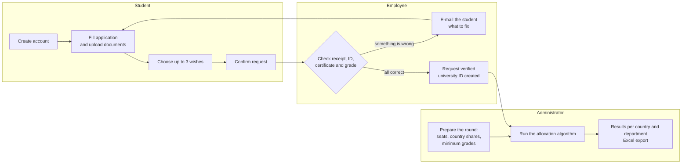
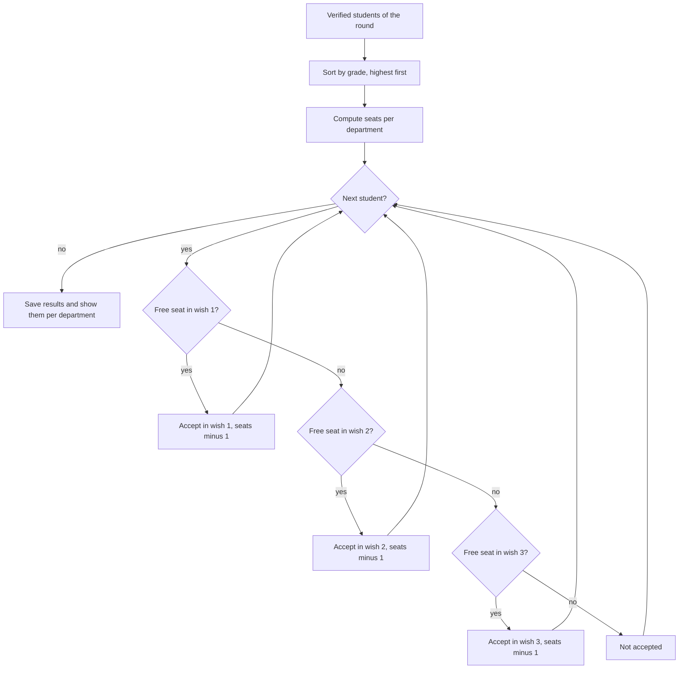
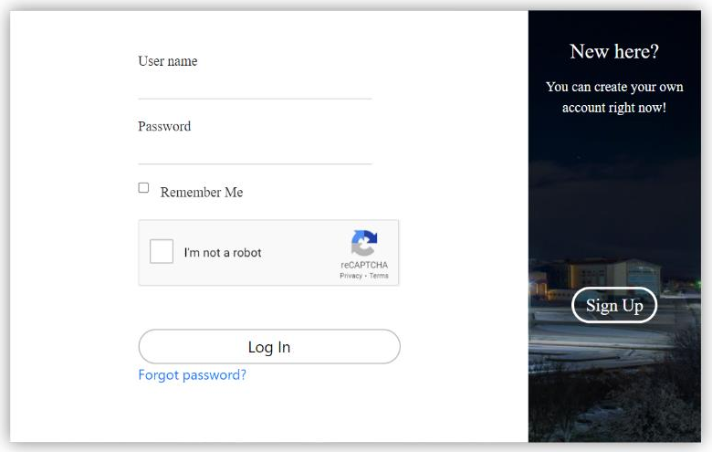
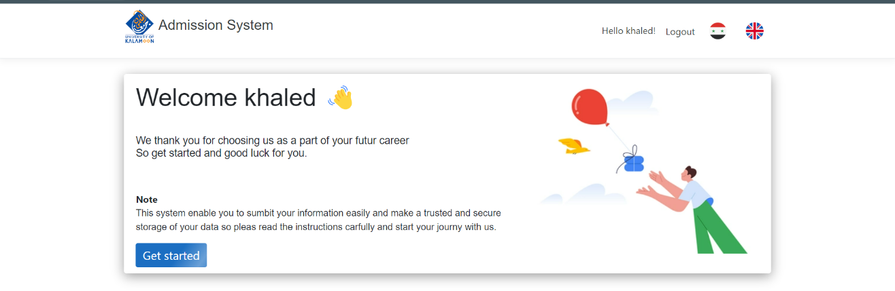
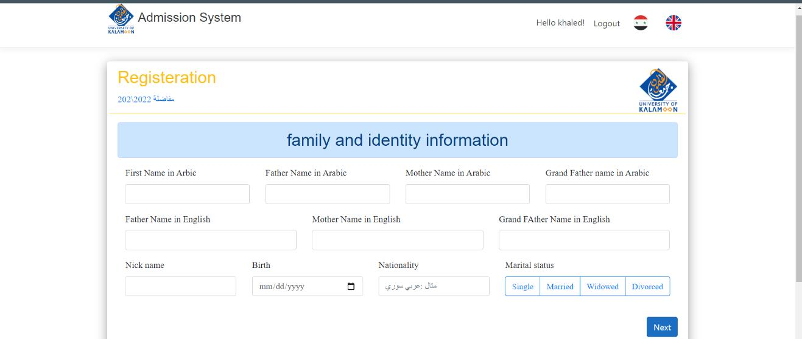
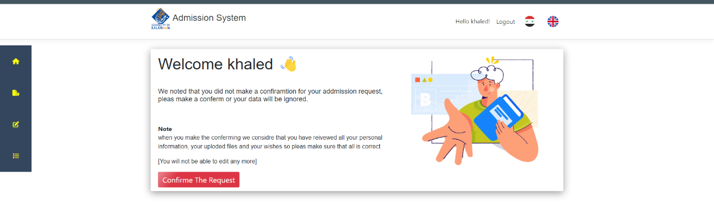
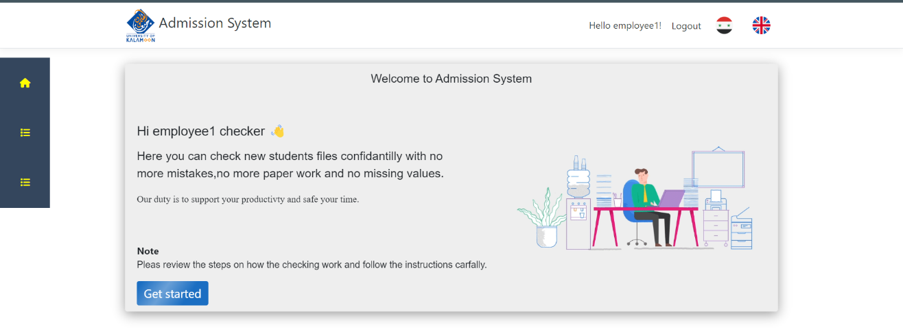
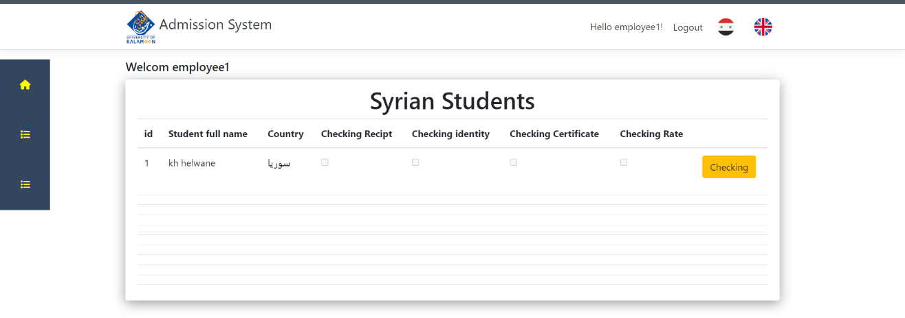
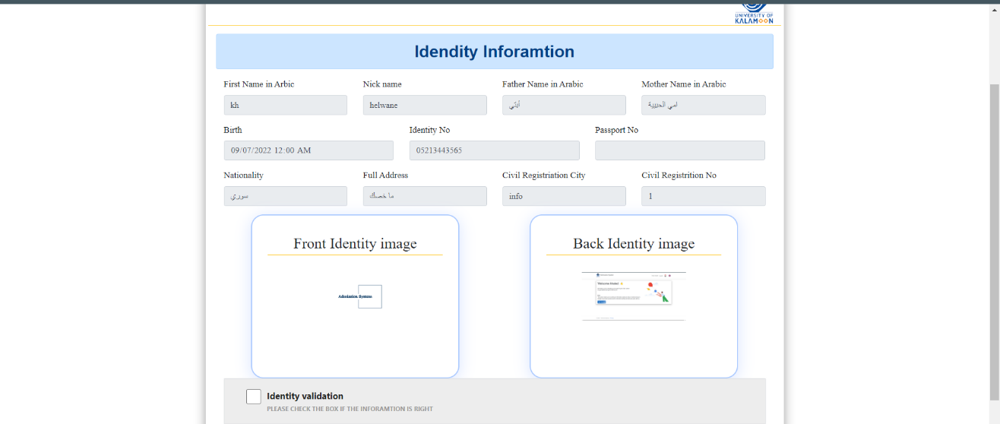
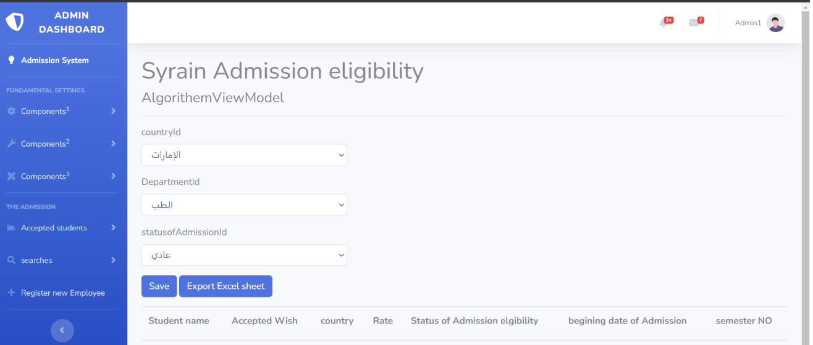

# Online Admission Eligibility System – University of Kalamoon

**A web application that moves a whole university admission round online: students apply from anywhere, employees verify the documents, and an algorithm assigns the available seats by grade and preference.**

B.Eng. graduation project · Department of Information Technology · University of Kalamoon (Syria) · 2021–2022


| | |
|---|---|
| 📄 **Graduation report** | [docs/Graduation_Report.pdf](docs/Graduation_Report.pdf) · [Google Drive copy](https://drive.google.com/file/d/1RKsxE_JlZ7N1uUvyYiW0nGjjiqP4L1ul/view) |
| 📘 **Project guide** (plain-language explanation) | [docs/PROJECT-GUIDE.md](docs/PROJECT-GUIDE.md) |
| 🔐 **Security review** (2026) | [docs/SECURITY-REVIEW.md](docs/SECURITY-REVIEW.md) |
| 🌐 **Live demo** | Deployed in 2022 at `addmission.biancostore.com`. That deployment is no longer online, so the screenshots below show the running system. |

---

## The problem

Every year the University of Kalamoon runs an *admission round* (مفاضلة): thousands of high-school graduates apply, and the university decides who gets a seat in which department.

In the 2021–2022 round this was done on paper:

- about **4,000 paper applications** had to be typed into a database by hand,
- by **7 employees** in only **5 days**,
- students (including students outside Syria) had to come to the campus in person,
- typing mistakes could put a student in the wrong department, and accepting too many students can mean fines for the university.

## The solution

A bilingual (Arabic / English) web application with three kinds of users:

| User | What they do in the system |
|---|---|
| 🎓 **Student** | Creates an account, fills a multi-step application, uploads the ID card, certificate and payment receipt, chooses up to **3 wishes** (only departments that match their grade and certificate type), confirms the request and follows its status. |
| 🧾 **Admission employee** | Takes requests from a queue, locks one, checks 4 things (payment receipt, identity, certificate country, grade), corrects the grade or certificate type if needed (every change is logged), and e-mails the student when something must be fixed. A verified request gets a university ID. |
| 🛠️ **Administrator** | Manages faculties, departments, countries and certificate types, opens and closes admission rounds, sets the seats per department, the share of seats per country and the minimum grade per department, creates employee accounts, runs the allocation algorithm and exports the results to Excel. |



## How seats are allocated

The algorithm is a greedy, merit-based allocation (the same idea used by many public admission systems):

1. Take all **verified** students of the selected admission round and certificate kind (Syrian / non-Syrian).
2. **Sort them by grade**, highest first.
3. Work out the seats of each department for this group:
   `seats = department seats × country share % × certificate-type share %`
4. Go through the students in order. Each student gets **the first of their 3 wishes that still has a free seat**; that department then has one seat less. If none of the wishes has a seat, the student is not accepted.



A worked example with numbers is in the [project guide](docs/PROJECT-GUIDE.md#5-the-seat-allocation-algorithm).

## Screenshots

| | |
|---|---|
| <br/>Login with reCAPTCHA and sign-up | <br/>Student home page |
| <br/>Multi-step application form | <br/>Student confirms the request |
| <br/>Employee home page | <br/>Queue of requests to check |
| <br/>Employee checks identity documents | <br/>Admin runs the algorithm and exports Excel |

## Tech stack

| Layer | Technology |
|---|---|
| Back end | ASP.NET Core 3.1 MVC (C#), dependency injection, repository pattern |
| Data | Entity Framework Core 3.1 (code-first migrations), SQL Server |
| Accounts | ASP.NET Core Identity – password hashing, roles (Admin / Employee / Student), e-mail confirmation and password reset tokens |
| Front end | Razor views, Bootstrap, jQuery + unobtrusive validation, SB Admin 2 dashboard, SweetAlert2, AOS animations |
| Languages | Arabic (default, `ar-SY`) and English with `.resx` resource files |
| Other | MailKit / MimeKit (SMTP e-mail), Google reCAPTCHA v2, ClosedXML (Excel export) |

## Project structure

```text
AdmissionSystem/
├── AdmissionSystem.sln
└── AdmissionSystem/
    ├── Controllers/
    │   ├── Identity_control/AccountController.cs   login, sign-up, passwords, employee accounts
    │   ├── StudenController.cs                      students with a Syrian certificate
    │   ├── StudentUnsyrianController.cs             students with a foreign certificate
    │   └── sub_classes/
    │       ├── EmployeeController.cs                checking and verifying requests
    │       └── Admin_classes/                       admin pages and AlgorithmController (seat allocation)
    ├── Model/                 entities + Repository/ (one generic CRUD interface, one repository per entity)
    ├── View_Model/            data shown on each page
    ├── Views/                 Razor pages for every controller
    ├── Resources/             Arabic and English texts (.resx)
    ├── Data/                  DbContext and seed data (faculties, departments, countries, ...)
    ├── Migrations/            EF Core database schema
    ├── Services/              e-mail sending, safe file uploads
    └── wwwroot/               CSS, JavaScript, images, Uploads/ (student documents, not in Git)
docs/                          graduation report, project guide, security review, images
```

## Run it locally

**You need:** Visual Studio 2019 or 2022 with the *ASP.NET and web development* workload, the **.NET Core 3.1 SDK** ([download archive](https://dotnet.microsoft.com/download/dotnet/3.1)) and SQL Server LocalDB (installed with Visual Studio).

1. Clone the repository and open `AdmissionSystem/AdmissionSystem.sln`.
2. Choose a password for the two seeded admin accounts (`Admin1`, `Admin2`). It must have an upper-case letter, a lower-case letter, a digit and a symbol:

   ```powershell
   cd AdmissionSystem/AdmissionSystem
   dotnet user-secrets set "SeedAdmin:Password" "Choose-A-Strong-Password-1"
   ```

3. Create the database. In Visual Studio open *Tools → NuGet Package Manager → Package Manager Console* and run `Update-Database`.
4. Press **F5**, then log in as `Admin1` with the password from step 2.
5. As admin, prepare an admission round (round dates, seats per department, share per country, minimum grades), then create a student account with **Sign Up**.

Optional settings (also with `dotnet user-secrets set ...`):

| Setting | Used for |
|---|---|
| `MailSettings:Email`, `MailSettings:Password` (+ `Host`, `Port`) | E-mails: employee account confirmation, password reset, messages to students |
| `GoogleReCaptcha:SiteKey`, `GoogleReCaptcha:SecretKey`, `GoogleReCaptcha:Enabled` | Server-side reCAPTCHA check on the login page |
| `ConnectionStrings:DefaultConnection` | A different SQL Server than LocalDB |

> Without an SMTP account, new employee accounts cannot confirm their e-mail. For local testing you can set `EmailConfirmed = 1` for that user in the `AspNetUsers` table.

**On a server**, set the same values as environment variables (for example `ConnectionStrings__DefaultConnection`, `SeedAdmin__Password`) or in an `appsettings.Production.json` file. That file is listed in `.gitignore` and must never be committed.

## Security review (2026)

In 2026, Abdullah Darwish (now studying cybersecurity) reviewed this 2022 project the way an attacker would look at it. The review found **17 security issues and 12 correctness issues**, including:

- production database, e-mail and reCAPTCHA secrets committed to the repository,
- a public page that let anyone create an **administrator** account,
- students able to change **other students' applications** (IDOR) and to raise their own grade after it was verified,
- a path-traversal bug in file uploads that could delete files on the server,
- a crash in the allocation algorithm whenever a student was accepted into their 2nd or 3rd wish.

The critical and high issues are fixed (one of them partly) in this repository. Every finding, its impact and its fix are described in **[docs/SECURITY-REVIEW.md](docs/SECURITY-REVIEW.md)**.

## Known limitations and next steps

- .NET Core 3.1 has been out of support since December 2022. The next step is an upgrade to a supported LTS version of .NET.
- Uploaded documents are still stored under `wwwroot` (now with random, unguessable names). They should move outside `wwwroot` and be served only to the owner and to employees.
- The project has no automated tests yet. The allocation algorithm is the first candidate.
- Students cannot see their final result inside the system yet. The results are exported to Excel and published by the university.
- The 2022 report planned a mobile-friendly version for future admission rounds.

## Team

- **Abdullah Darwish** – developer ([GitHub](https://github.com/AbdullahEng))
- **Khaled Alhelwane** – developer

**Supervisors:** Dr. Mariam Saii, Eng. Maher Noah, Eng. Haitham Saffour – Faculty of Engineering, University of Kalamoon.

Thanks to Dr. Saed Al-Nazer (Vice President for Administrative and Student Affairs) and Mr. Iyad Fatihallah for explaining how the admission process works in practice.
