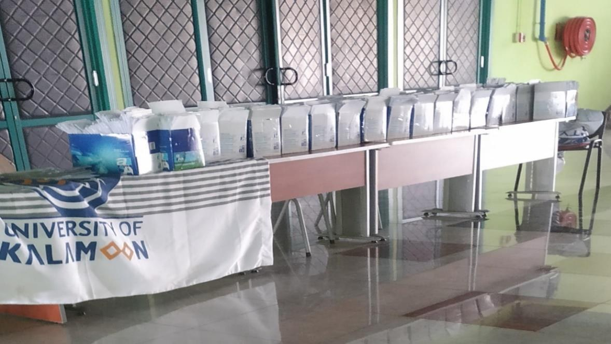
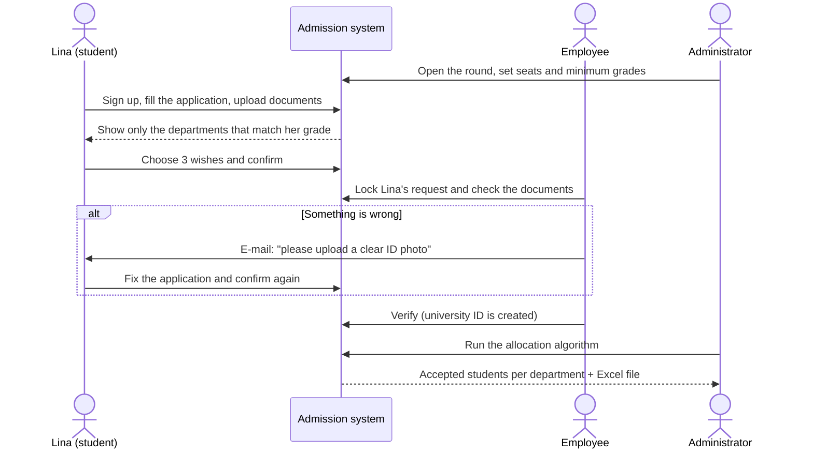
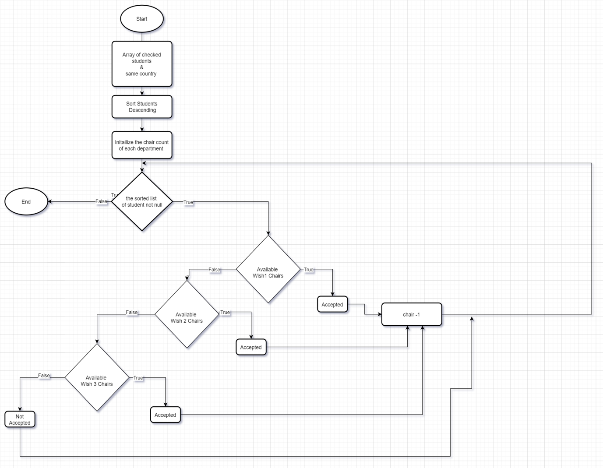
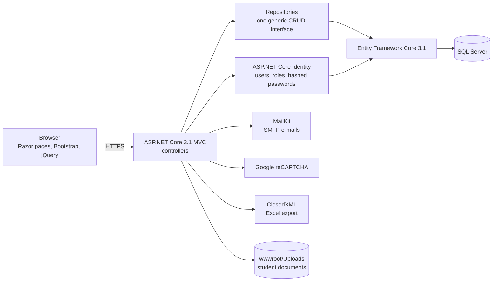
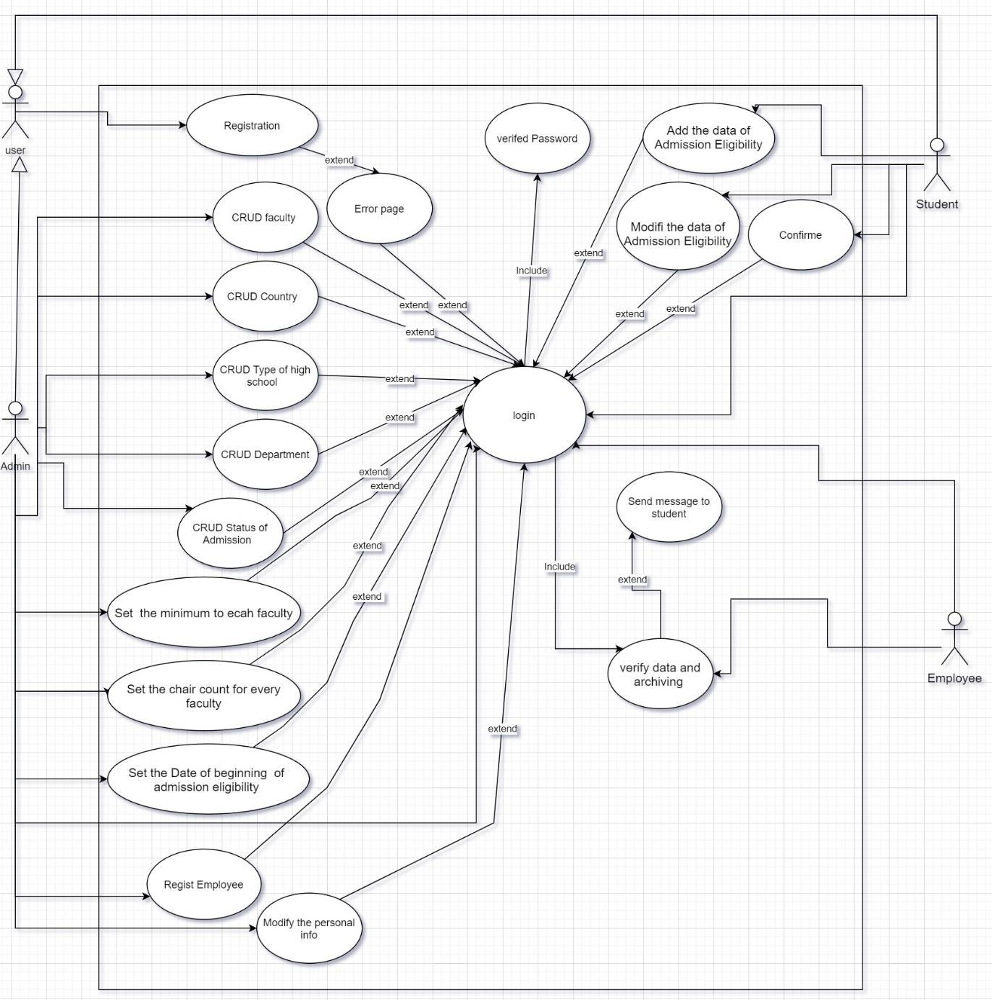
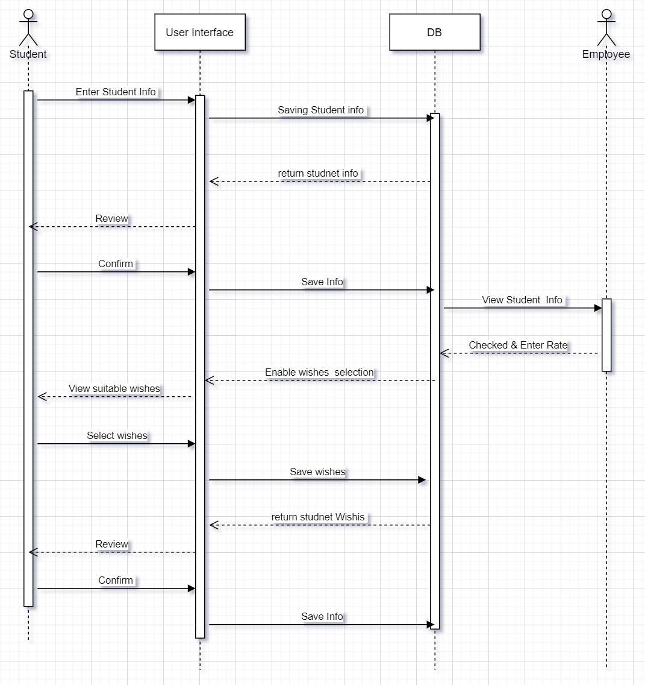
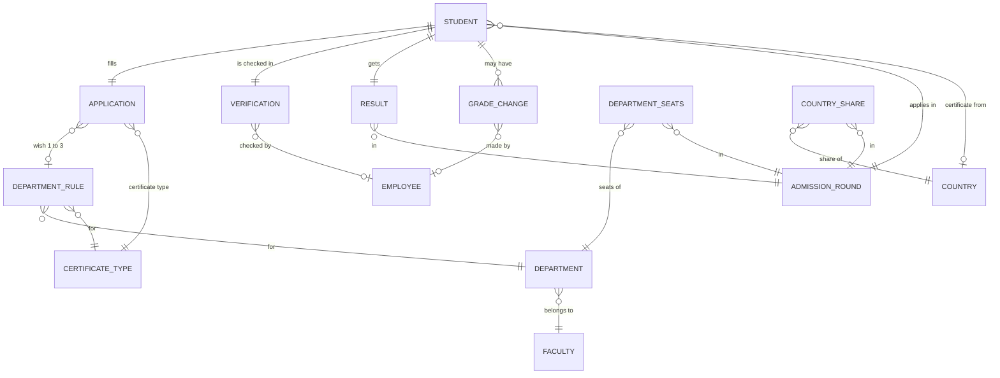

# Project guide – Online Admission Eligibility System

This guide explains the project for anyone: a recruiter, a new developer, or a university employee.
Sections 1–5 need no programming knowledge. Sections 6–9 are for developers.

**Contents**

1. [The project in one minute](#1-the-project-in-one-minute)
2. [Why the university needed it](#2-why-the-university-needed-it)
3. [Who uses the system](#3-who-uses-the-system)
4. [The journey of one application](#4-the-journey-of-one-application)
5. [The seat allocation algorithm](#5-the-seat-allocation-algorithm)
6. [How the system is built](#6-how-the-system-is-built)
7. [The database](#7-the-database)
8. [Request status codes (developer reference)](#8-request-status-codes-developer-reference)
9. [Security](#9-security)
10. [What we learned](#10-what-we-learned)
11. [Glossary](#11-glossary)
12. [Credits and sources](#12-credits-and-sources)

---

## 1. The project in one minute

- **What:** a web application that runs a university *admission round* online, from the first application to the final list of accepted students.
- **For whom:** the University of Kalamoon (UOK), a private university in Deir Atiyah, Syria. It has faculties of medicine, engineering, business, arts and law.
- **Why:** the old process used paper. About 4,000 applications had to be typed in by 7 employees in 5 days, and mistakes could send a student to the wrong department.
- **How:** students apply online and upload their documents, employees verify each request on screen, and an algorithm gives each seat to the best-ranked student who asked for it.
- **Built with:** ASP.NET Core MVC (C#), Entity Framework Core, SQL Server, ASP.NET Core Identity, Bootstrap. The interface is in Arabic and English.
- **Who built it:** Abdullah Darwish and Khaled Alhelwane, as their B.Eng. graduation project (Department of Information Technology, 2021–2022).

## 2. Why the university needed it

An *admission round* (Arabic: **مفاضلة**) is the period when high-school graduates apply to the university. Each applicant lists the departments they want, in order of preference. The university then accepts students by grade until the seats are full.



*Applications of the 2021–2022 round, all on paper (photo from the graduation report).*

The team interviewed the people who run the process (the Vice President for Administrative and Student Affairs, the vice dean of engineering and an admission employee) and studied the admission forms. They found three problems:

| Problem | Effect |
|---|---|
| **Paper and space** | Thousands of files need physical space. Students, including those living outside Syria, had to come to the campus. |
| **Not enough staff** | Volunteers were needed to help students fill the forms. |
| **Very little time** | About 4,000 files had to be typed into a database by 7 employees in 5 days. Tired employees make typing mistakes, and one wrong grade or wish can change a student's whole career. Accepting more students than allowed can also cost the university fines. |

An earlier desktop program could calculate results from an Excel sheet, but the data still had to be typed in by hand. A previous student project based on a workflow tool was not adopted because its screens were hard to use.

**Goal of this project:** remove the paper, let students apply from anywhere, make checking faster and more accurate, and calculate the results automatically.

## 3. Who uses the system

### 🎓 Students

Two kinds of students use the system, because the rules are different:

- students with a **Syrian** high-school certificate, and
- students with a **foreign (non-Syrian)** certificate. An employee has to convert their grade to the Syrian scale before they can choose departments.

A student can:

- create an account (user name, e-mail, national ID number, birth date, certificate kind),
- fill a 4-step application: family and identity details, contact details, certificate details, and uploads (ID card front and back, certificate, payment receipt),
- choose up to **3 wishes**. The list only shows departments whose minimum grade is not higher than the student's grade and that accept the student's certificate type,
- confirm the request (after that it can no longer be edited),
- fix the application when an employee asks for it by e-mail,
- follow the status of the request, and use the site in Arabic or English.

### 🧾 Admission employees

An employee can:

- see a queue of confirmed requests (Syrian and non-Syrian lists),
- **lock** a request, so two employees never check the same file at the same time,
- check 4 things: the **payment receipt**, the **identity** documents, the **country of the certificate** and the **grade**,
- correct the grade, the country or the certificate type. Every correction is saved with the old value, the new value, the employee and the date,
- send the student an e-mail explaining what is wrong,
- verify the request. The system then gives the student a **university ID** (year + semester + a 4-digit number).

### 🛠️ Administrators

An administrator prepares and closes the admission round:

- manages faculties, departments, countries and certificate types,
- creates **admission rounds** (type, start date, semester, number of students allowed) and opens or closes them,
- sets the **number of seats** of each department in a round,
- sets the **share of seats for each country** (for example 80 % of the seats for students with a Syrian certificate),
- sets, for each department and certificate type, the **minimum grade** and the **share of the seats**,
- creates employee and admin accounts,
- runs the **allocation algorithm**, sees the accepted students per country and department, and exports them to **Excel**,
- sees statistics on a dashboard (students per country, checked and not checked requests, accepted and not accepted).

## 4. The journey of one application

The story below follows Lina, an example student with a Syrian scientific certificate.



1. **Sign up.** Lina creates an account. She chooses "Syrian certificate", so she uses the Syrian student pages.
2. **Application.** She fills the 4 steps and uploads 4 images. Until she confirms, she can come back and edit it while the round is open.
3. **Wishes.** Her grade is 2,150 out of 2,300, which is about **93.5 %**. The page only lists departments whose minimum grade is 93.5 % or lower and that accept a scientific certificate. She picks Medicine, Pharmacy and IT.
4. **Confirmation.** She confirms. From now on she cannot change the request, and it appears in the employees' queue.
5. **Checking.** An employee locks the request and compares the uploaded documents with the typed data. If the ID photo is not readable, the employee writes a message and the system e-mails Lina. She fixes it and confirms again.
6. **Verified.** When all 4 checks pass, the request is verified and Lina gets a university ID.
7. **Results.** After the round closes, the administrator runs the algorithm (next section) and exports an Excel list of the accepted students for every department, which the university publishes.

## 5. The seat allocation algorithm

### The idea

The student with the highest grade chooses first. Each student gets **the first of their wishes that still has a free seat**. This is a *greedy, merit-based* allocation, the same idea used by many public admission systems.

### Step by step

1. **Who takes part:** only students whose 4 checks are all verified, from the selected admission round and certificate kind (Syrian or non-Syrian). For non-Syrian certificates, only students from the selected country take part, because each country has its own share of seats.
2. **Order:** sort the students by grade, highest first.
3. **Seats for this group:**

   ```text
   seats of a department = department seats in the round
                           × share of the country (%)
                           × share of the certificate type (%)   (Syrian certificates only)
   ```

4. **Allocation:** for each student in order, try wish 1, then wish 2, then wish 3. The first department with a free seat accepts the student, and its seat count goes down by one. If no wish has a free seat, the student is not accepted in this round.

The original flowchart from the graduation report:



### Worked example

Setup of the round (all students have a Syrian scientific certificate, and scientific certificates may use 100 % of the seats):

| Department | Seats in the round | Share for Syria | Seats for this group |
|---|---|---|---|
| Medicine | 5 | 40 % | 5 × 40 % × 100 % = **2** |
| Pharmacy | 5 | 40 % | **2** |
| IT Engineering | 5 | 40 % | **2** |

Verified students, already sorted by grade:

| Student | Grade (of 2,300) | Wish 1 | Wish 2 | Wish 3 |
|---|---|---|---|---|
| Rana | 2,250 | Medicine | Pharmacy | – |
| Omar | 2,240 | Medicine | IT Engineering | – |
| Sami | 2,200 | Medicine | Pharmacy | – |
| Lina | 2,150 | Medicine | Pharmacy | IT Engineering |
| Yara | 2,100 | Pharmacy | Medicine | – |

What the algorithm does:

| Turn | Student | Result | Seats left (Med / Pharm / IT) |
|---|---|---|---|
| 1 | Rana | Medicine (wish 1) | 1 / 2 / 2 |
| 2 | Omar | Medicine (wish 1) | 0 / 2 / 2 |
| 3 | Sami | Medicine is full → **Pharmacy** (wish 2) | 0 / 1 / 2 |
| 4 | Lina | Medicine is full → **Pharmacy** (wish 2) | 0 / 0 / 2 |
| 5 | Yara | Pharmacy and Medicine are full, no wish 3 → **not accepted** | 0 / 0 / 2 |

Yara is not accepted even though IT Engineering still has seats, because she did not choose it. This is why the application asks students to use all 3 wishes.

### Minimum grades

A student can only choose departments where `grade × 100 / 2300 ≥ minimum grade of the department`. The database is seeded with these example values (scientific certificate unless noted):

| Department | Minimum grade |
|---|---|
| Medicine | 83 % |
| Dentistry, Pharmacy | 78 % |
| Architecture, Civil Engineering, IT Engineering, Mechatronics | 68 % (IT and Mechatronics: 83 % with a computer vocational certificate) |
| Management, Banking and Finance | 56 % (scientific or literary), 63 % (commerce) |
| Interior Design, Graphic Design | 56 % (scientific or literary), 63 % (arts vocational) |

The administrator can change all of these values.

## 6. How the system is built



| Part | How it is used |
|---|---|
| **MVC pattern** | *Models* are the C# classes of the data, *views* are Razor pages (HTML + C#), *controllers* receive each request and choose what to show. |
| **Dependency injection** | Every repository is registered once in `Startup.cs` and given to the controllers that need it, so controllers do not create their own database objects. |
| **Repository pattern** | `CRUD_Operation_Interface<T>` defines `List`, `Find`, `Add`, `Update`, `Delete`. Each entity has a repository class that implements it. |
| **Entity Framework Core** | Creates the database from the C# classes (code-first migrations) and fills it with starting data (faculties, departments, countries, certificate types). |
| **ASP.NET Core Identity** | Stores accounts with hashed passwords, gives each user a role (Admin, Employee, Student), and creates the tokens for e-mail confirmation and password reset. |
| **Localization** | All texts are in `.resx` files in Arabic and English. Arabic (`ar-SY`) is the default. The flag buttons switch the language. |
| **Client-side validation** | jQuery Validation checks the forms in the browser before they are sent (the server checks them again). |
| **E-mail** | MailKit sends confirmation links, password reset links and employee messages through SMTP. |
| **reCAPTCHA** | Google reCAPTCHA v2 on the login page. |
| **Excel export** | ClosedXML creates the list of accepted students per department. |

The original design diagrams from the report:

| Use case diagram | Sequence diagram (non-Syrian student) |
|---|---|
|  |  |

## 7. The database



| Name in the diagram | Class in the code | What it stores |
|---|---|---|
| STUDENT | `Student` | Personal, family and contact data, ID card images, status code, university ID |
| APPLICATION | `Admission_Eligibilty_Certificate` | Grade, certificate details and images, payment receipt, the 3 wishes |
| VERIFICATION | `Statues_Of_Student` | The 4 checks, the lock, the employee and the date |
| GRADE_CHANGE | `Tracking_Rate` | Old and new grade, country and certificate type after an employee correction |
| RESULT | `Accabtable_config` | Accepted or not, and the accepted department |
| ADMISSION_ROUND | `Statues_of_admission_eligibilty` | Round type, start date, semester, open or closed |
| DEPARTMENT_SEATS | `Broken_Relationshib_Stat_Dep_Chair` | Number of seats of a department in a round |
| COUNTRY_SHARE | `Persentage_count_for_each__country` | Share of the seats (%) for one country |
| DEPARTMENT_RULE | `Department_relation_Type` | For one department and one certificate type: minimum grade and share of seats |
| DEPARTMENT, FACULTY, COUNTRY, CERTIFICATE_TYPE, EMPLOYEE | `Department`, `Faculty`, `Country`, `Type_of_high_school_Cirtificate`, `Employee` | Reference data and staff |

Accounts and roles are stored in the standard ASP.NET Core Identity tables (`AspNetUsers`, `AspNetRoles`, ...). The full ERD from the report, with notes in Arabic, is in [images/diagram-erd.jpg](images/diagram-erd.jpg).

## 8. Request status codes (developer reference)

The status of an application is stored as a number in `Student.Conformation`:

| Code | Meaning | Set by |
|---|---|---|
| 0 | New: the student is still filling the application | Registration |
| 1 | Confirmed by the student and waiting for checking. A Syrian request stays at 1 after it is verified | Student / employee |
| 2 | Verified, and the student must now choose wishes. Syrian: the employee corrected the grade, country or certificate type. Non-Syrian: the employee entered the converted grade | Employee |
| 3 | The employee asked the student to fix something (e-mail sent) | Employee |
| 4 | Syrian: the employee asked for a fix **and** corrected data, so the wishes must be chosen again | Employee |
| 5 | Syrian: the student fixed the application after code 3 | Student |
| 6 | Syrian: the student chose new wishes after code 4 | Student |

Pages check this code to decide what a student may do. For example, the application cannot be edited at codes 1 and 2. Since the 2026 update these checks also run on the server for every form that is sent, not only when a page is opened.

## 9. Security

The project uses the standard protections of ASP.NET Core: hashed passwords (Identity), roles for every area, anti-forgery tokens on forms, e-mail confirmation for staff accounts, HTTPS redirection and HSTS in production.

In 2026 Abdullah reviewed the code from a security point of view and fixed the most serious problems he found (for example a public page that could create administrator accounts, and students being able to change other students' applications). The full report is in [SECURITY-REVIEW.md](SECURITY-REVIEW.md).

## 10. What we learned

From the conclusion of the graduation report:

- a real project is very different from theory. This project was our first step into professional work,
- we learned ASP.NET Core, dependency injection and ASP.NET Core Identity from zero,
- working as a team and pair programming helped us solve problems faster, but sharing work through GitHub was hard at first,
- collecting requirements takes time. The people responsible for admission were busy, so the requirements were only complete in the 7th week of the semester.

Looking back in 2026, one more lesson: **every check that the browser does must be done again on the server.** Several of the problems in the security review came from rules that were only enforced by the page (hidden fields and filtered lists), not by the controller.

## 11. Glossary

| Term | Meaning |
|---|---|
| Admission round (مفاضلة) | The period in which students apply and seats are given out |
| Wish (رغبة) | A department a student wants, in order of preference (up to 3) |
| Grade / rate (معدل) | The student's total mark in the high-school certificate. The code assumes a maximum of 2,300 |
| Certificate type | Scientific (علمي), literary (أدبي), commerce (تجارة), computer vocational (مهني حاسوب), arts vocational (مهني فنون) |
| Syrian / non-Syrian certificate | Where the high-school certificate was issued. Non-Syrian grades are converted by an employee |
| Seats (chairs) | How many students a department can accept in a round |
| Country share | The percentage of a department's seats reserved for students with a certificate from one country |

## 12. Credits and sources

- **Students:** Abdullah Darwish, Khaled Alhelwane
- **Supervisors:** Dr. Mariam Saii, Eng. Maher Noah, Eng. Haitham Saffour
- **University:** University of Kalamoon, Faculty of Engineering, Department of Information Technology
- **Full report:** [Graduation_Report.pdf](Graduation_Report.pdf) (English, with an Arabic summary at the end)
- **Main references of the report:** UOK admission procedures (2021), *The Little ASP.NET Core Book* (N. Barbettini, 2018), Microsoft documentation on Tag Helpers and NuGet, Bootstrap documentation.
